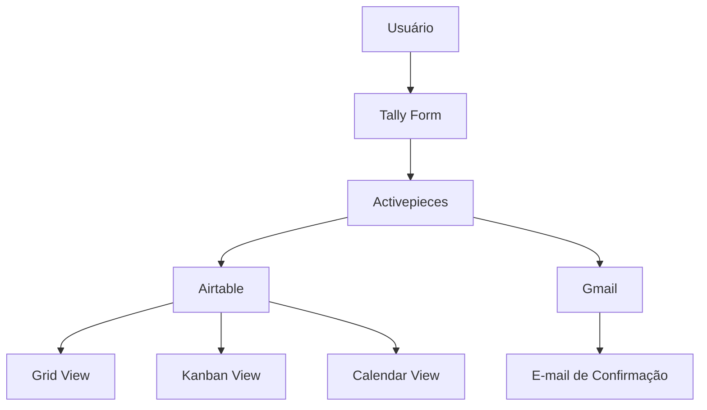

# Sistema de HelpDesk NoCode


## Descrição

Este projeto implementa uma solução de HelpDesk NoCode capaz de receber solicitações de suporte através de formulários online, armazenar e organizar os chamados em uma base centralizada e automatizar processos de comunicação e registro.

A solução integra **Tally**, **Airtable**, **Activepieces** e **Gmail** para fornecer um fluxo completo de atendimento, desde a abertura do chamado até a confirmação automática ao usuário, garantindo rastreabilidade, organização e escalabilidade do processo de suporte.

---

## Contexto Acadêmico

Este projeto foi desenvolvido para fins educacionais e de demonstração de conceitos de automação de processos utilizando ferramentas NoCode.

---

## Objetivos

- Centralizar solicitações de suporte.
- Automatizar o registro de chamados.
- Melhorar o acompanhamento dos atendimentos.
- Reduzir atividades manuais.
- Garantir rastreabilidade dos tickets.
- Facilitar a comunicação entre usuários e equipe de suporte.

---

# Arquitetura da Solução



---

# Estrutura do Repositório

```text
.
├── README.md
├── LICENSE
│
└── docs
    ├── Criacao_Formulario_Tally.pdf
    ├── Configuracao_Airtable_HelpDesk.pdf
    └── Guia_Activepieces_Integracao_Completo.pdf
```

---

# Fluxo de Funcionamento

```text
1. Usuário abre um chamado pelo formulário

2. Tally registra a submissão

3. Activepieces captura o evento

4. Activepieces cria um registro no Airtable

5. Status inicial é definido como "Recebido"

6. Gmail envia confirmação ao usuário

7. Equipe acompanha o ticket pelo Airtable

8. Atualizações ficam registradas automaticamente
```

---

# Tecnologias Utilizadas

| Ferramenta | Finalidade |
|------------|------------|
| Tally | Formulário de abertura de chamados |
| Airtable | Banco de dados e gerenciamento dos tickets |
| Activepieces | Automação dos fluxos |
| Gmail | Notificações automáticas |

---

# Funcionalidades

## Abertura de Chamados

O usuário pode informar:

- Nome completo
- E-mail
- Tipo de solicitação
- Descrição do problema
- Categoria do problema
- Prioridade
- Arquivo de referência

---

## Lógica Condicional

O formulário exibe campos específicos conforme o tipo de solicitação selecionado.

### Exemplo

#### TI

```text
O problema está relacionado a:

- Hardware
- Software
```

#### Design

```text
Upload de arquivo de referência
```

---

## Gestão dos Chamados

### Grid View

Visualização tabular completa dos registros.

### Kanban View

Fluxo visual dos atendimentos.

```text
Recebido
    ↓
Em Processo
    ↓
Resolvido
```

### Calendar View

Visualização baseada na data de abertura dos chamados.

---

# Estrutura da Base de Dados

Tabela:

```text
Chamados Abertos
```

| Campo | Tipo |
|---------|---------|
| Nome | Single Line Text |
| E-mail | Email |
| Tipo | Single Line Text |
| Descrição | Long Text |
| Prioridade | Single Line Text |
| Sessão_TI | Single Line Text |
| Arquivo | Attachment |
| Data_Abertura | Date |
| Ultima_Atualização | Last Modified Time |
| Status | Single Select |

---

# Visualizações Criadas

## Grid

Consulta detalhada dos chamados.

## Kanban

Gerenciamento do fluxo operacional.

Colunas sugeridas:

```text
Recebido
Em Processo
Aguardando Cliente
Resolvido
Fechado
```

## Calendar

Acompanhamento temporal dos chamados.

---

# Configuração do Tally

## Campos Criados

| Campo | Tipo |
|---------|---------|
| Nome Completo | Short Answer |
| E-mail | Email |
| Tipo de Solicitação | Multiple Choice |
| Descrição do Pedido | Long Answer |
| Categoria TI | Multiple Choice |
| Referência | File Upload |
| Prioridade | Multiple Choice |

---

# Configuração do Airtable

## Workspace

```text
HelpDesk
```

## Base

```text
Sistema de Help Desk
```

## Tabela

```text
Chamados Abertos
```

---

# Configuração do Activepieces

## Projeto

```text
HelpDesk
```

## Flow

```text
Sistema HelpDesk
```

### Trigger

```text
Nova Submissão (Tally)
```

### Ações

```text
1. Criar Registro no Airtable

2. Enviar E-mail via Gmail
```

---

# Mapeamento dos Campos

| Airtable | Tally |
|-----------|-----------|
| Nome | Nome Completo |
| E-mail | Seu E-mail |
| Descrição | Descrição do Pedido |
| Prioridade | Nível de Prioridade |
| Sessão_TI | Problema Relacionado |
| Status | Recebido |

---

# Variáveis e Credenciais

## Tally

```env
TALLY_API_KEY=xxxxxxxxxxxxxxxx
TALLY_FORM_ID=xxxxxxxxxxxxxxxx
```

## Airtable

```env
AIRTABLE_PERSONAL_ACCESS_TOKEN=patxxxxxxxxxxxxxxxx
AIRTABLE_BASE_ID=appxxxxxxxxxxxxxxxx
AIRTABLE_TABLE_NAME=Chamados_Abertos
```

## Activepieces

```env
ACTIVEPIECES_PROJECT=HelpDesk
ACTIVEPIECES_FLOW=Sistema_HelpDesk
```

> Nunca exponha credenciais reais no repositório.

---

# Passo a Passo de Implantação

## 1. Criar Formulário no Tally

- Criar novo formulário.
- Adicionar os campos necessários.
- Configurar Conditional Logic.
- Publicar formulário.

## 2. Criar Workspace no Airtable

```text
HelpDesk
```

## 3. Criar Base

```text
Sistema de Help Desk
```

## 4. Criar Tabela

```text
Chamados Abertos
```

## 5. Criar Visualizações

- Grid
- Kanban
- Calendar

## 6. Criar Projeto no Activepieces

```text
HelpDesk
```

## 7. Criar Flow

Trigger:

```text
Nova Submissão Tally
```

## 8. Conectar Tally

Gerar API Key em:

```text
Settings → API Keys
```

## 9. Conectar Airtable

Gerar Personal Access Token.

Permissões necessárias:

```text
data.records:read
data.records:write
schema.bases:read
```

## 10. Conectar Gmail

Autorizar conta Google para envio automático de notificações.

---

# Testes

## Teste do Formulário

- Abrir formulário.
- Preencher todos os campos.
- Enviar solicitação.

## Teste da Integração

Validar:

```text
Tally → Activepieces → Airtable
```

## Teste do E-mail

Verificar recebimento do e-mail de confirmação.

### Exemplo

**Assunto**

```text
Seu chamado foi recebido
```

**Mensagem**

```text
Obrigado por contatar nosso helpdesk!

Sua solicitação foi registrada e será respondida em breve.
```

---

# Benefícios da Solução

- 100% NoCode
- Baixo custo de implementação
- Escalabilidade
- Facilidade de manutenção
- Centralização dos chamados
- Rastreabilidade completa
- Automação ponta a ponta

---

# Melhorias Futuras

- Dashboard gerencial
- SLA automático
- Integração com Microsoft Teams
- Integração com Slack
- Chatbot de atendimento
- Pesquisa de satisfação
- Relatórios automáticos
- Base de conhecimento

---

# Autor

Desenvolvido por Mariana Monteiro com o objetivo de demonstrar a implementação de soluções NoCode para automação de processos, gerenciamento de chamados e suporte técnico utilizando Tally, Airtable e Activepieces.

---

## Licença

Este projeto é distribuído sob a licença MIT.

A licença cobre toda a solução NoCode, incluindo a documentação, fluxos de automação, estrutura de banco de dados e demais artefatos desenvolvidos para o sistema de HelpDesk.

Consulte o arquivo `LICENSE` para mais informações.
